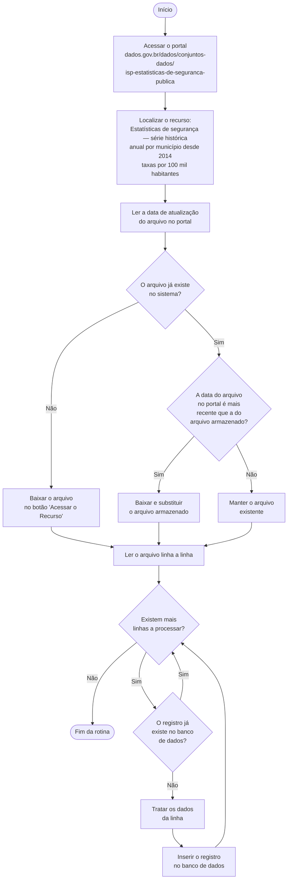

# roubometro-batch
Rotina batch usada para preenchimento e atualização de registros criminais do RJ da fonte original para o site.

---

## Fluxo da Rotina Batch

O organograma abaixo descreve o fluxo base da rotina batch do sistema Roubômetro.

